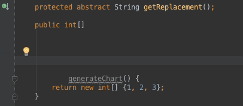
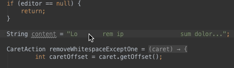

# Whitey

A IntelliJ IDEA plugin that adds some nifty utilities for working with whitespace in source code.


## Developer's Guide

Run:

```bash
make setup
```

This will download IntelliJ IDEA Community Edition into `./idea` which is a dependency
for building — and is rather large.

The project should be built from within IntelliJ IDEA itself, which makes sense.


## Actions

All the actions support multiple cursors.

__Remove All Adjacent Whitespace But One Whitespace__ Remove all expect whitespace before and after the caret(s).




__Remove All Adjacent Whitespace__ Remove all whitespace before and after the caret(s).



## License

The MIT License (MIT)

Copyright (c) 2015 Trifork AB

Permission is hereby granted, free of charge, to any person obtaining a copy
of this software and associated documentation files (the "Software"), to deal
in the Software without restriction, including without limitation the rights
to use, copy, modify, merge, publish, distribute, sublicense, and/or sell
copies of the Software, and to permit persons to whom the Software is
furnished to do so, subject to the following conditions:

The above copyright notice and this permission notice shall be included in
all copies or substantial portions of the Software.

THE SOFTWARE IS PROVIDED "AS IS", WITHOUT WARRANTY OF ANY KIND, EXPRESS OR
IMPLIED, INCLUDING BUT NOT LIMITED TO THE WARRANTIES OF MERCHANTABILITY,
FITNESS FOR A PARTICULAR PURPOSE AND NONINFRINGEMENT. IN NO EVENT SHALL THE
AUTHORS OR COPYRIGHT HOLDERS BE LIABLE FOR ANY CLAIM, DAMAGES OR OTHER
LIABILITY, WHETHER IN AN ACTION OF CONTRACT, TORT OR OTHERWISE, ARISING FROM,
OUT OF OR IN CONNECTION WITH THE SOFTWARE OR THE USE OR OTHER DEALINGS IN
THE SOFTWARE.